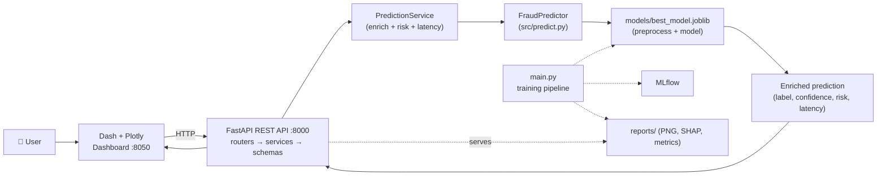

# Credit Card Fraud Detection

An **enterprise-grade, end-to-end machine-learning application** for detecting
fraudulent credit card transactions on a highly imbalanced dataset — from a
config-driven training pipeline to a layered FastAPI service and a bank-grade
analytics dashboard.

[](https://github.com/MohdMudassirPasha/credit-card-fraud-detection/actions/workflows/ci.yml)


---

## ✨ What this is

The repository contains **three cleanly separated layers** that together form a
production ML application:

1. **ML pipeline** (`src/`, `main.py`) — config-driven training, evaluation,
   tuning, MLflow tracking, SHAP explainability, and model selection. _Untouched
   by the serving layer — the API only ever loads the model, never retrains._
2. **REST API** (`app/`) — a layered FastAPI service (routers → services →
   schemas → core) that serves the production model with validation, dependency
   injection, middleware, centralized error handling, and OpenAPI docs.
3. **Dashboard** (`dashboard/`) — a responsive Dash + Plotly single-page app with
   glassmorphism styling, dark/light themes, a live prediction form, and
   interactive analytics — it talks to the API over HTTP, exactly like a real
   frontend.

```
User → Dash Dashboard (:8050) → FastAPI REST API (:8000) → PredictionService
     → FraudPredictor → preprocessing + model (best_model.joblib) → enriched response
```

Fraud is only ~0.17% of transactions, so accuracy is meaningless — a model that
always predicts "not fraud" scores 99.8%. Everything here is built around the
metrics that matter under imbalance: **precision, recall, F1, and PR-AUC**.

---

## 🏗️ Architecture

See [`docs/architecture.md`](docs/architecture.md) for full diagrams. In short:



---

## 📁 Project structure

```
credit-card-fraud-detection/
├── app/                          # FastAPI serving layer (layered architecture)
│   ├── main.py                   #   app factory: middleware, handlers, static, routers
│   ├── api.py                    #   back-compat shim → app.main:app
│   ├── startup.py                #   AppState singleton + one-time artifact loading
│   ├── dependencies.py           #   FastAPI dependency-injection providers
│   ├── core/                     #   settings, logging, middleware, exception handlers
│   ├── schemas/                  #   Pydantic models (transaction, prediction, meta)
│   ├── services/                 #   business logic (prediction, model, history)
│   ├── routers/                  #   endpoints (meta, health, prediction, model)
│   └── utils/                    #   risk scoring, timing helpers
├── dashboard/                    # Dash + Plotly frontend
│   ├── app.py                    #   Dash app shell + entrypoint
│   ├── api_client.py             #   HTTP client for the API
│   ├── sections.py               #   Overview / Predict / Model / History layouts
│   ├── components/               #   navbar, sidebar, cards, charts, prediction form
│   ├── callbacks/                #   navigation, prediction, theme callbacks
│   └── assets/styles.css         #   glassmorphism design system
├── src/                          # ML pipeline (training — untouched by serving)
│   ├── config.py, logger.py, exceptions.py, predict.py
│   ├── data/                     #   Kaggle download, synthetic generator, loader
│   ├── preprocessing.py, models.py, train.py, tune.py
│   ├── evaluate.py, explain.py, tracking.py
├── configs/config.yaml           # single source of truth for the pipeline
├── models/                       # best_model.joblib + model_metadata.json
├── reports/                      # plots, metrics, SHAP, Optuna (served as static)
├── tests/                        # pytest: pipeline + API + services + schemas + dashboard
├── docs/                         # architecture.md + screenshots
├── .github/workflows/ci.yml      # lint + type + test + smoke pipeline + docker build
├── main.py                       # end-to-end training CLI orchestrator
├── Dockerfile / docker-compose.yml / Makefile
└── requirements.txt / requirements-dev.txt / pyproject.toml
```

---

## 🚀 Quickstart

```bash
git clone https://github.com/MohdMudassirPasha/credit-card-fraud-detection.git
cd credit-card-fraud-detection

python -m venv .venv
source .venv/bin/activate          # Windows: .venv\Scripts\activate

pip install -r requirements-dev.txt   # runtime + dev (tests, linters, mypy)
```

The repo ships with a trained `models/best_model.joblib`, so you can serve
immediately. To retrain from scratch, see [Training](#-training-the-model).

### Run the full stack (API + dashboard)

```bash
# Terminal 1 — API
make api            # uvicorn app.main:app → http://localhost:8000  (docs at /docs)

# Terminal 2 — dashboard
make dashboard      # Dash → http://localhost:8050
```

Or run everything (API + dashboard + MLflow) with one command via Docker:

```bash
docker compose up --build
```

| Service   | URL                         |
| --------- | --------------------------- |
| Dashboard | http://localhost:8050       |
| API       | http://localhost:8000       |
| Swagger   | http://localhost:8000/docs  |
| ReDoc     | http://localhost:8000/redoc |
| MLflow    | http://localhost:5000       |

---

## 📊 Dashboard

A bank-grade analytics frontend built with **Dash + Plotly** — glassmorphism
cards, a dark/light theme toggle, a sidebar + top navigation, smooth animations,
and a fully responsive layout.

| Section      | Contents                                                                                                                                                                                                        |
| ------------ | --------------------------------------------------------------------------------------------------------------------------------------------------------------------------------------------------------------- |
| **Overview** | KPI cards (model, PR-AUC, ROC-AUC, requests served), model-comparison bar chart, class-distribution donut, and the confusion-matrix / ROC / PR curve images for the production model.                           |
| **Predict**  | A live transaction form (Time + Amount prominent, V1–V28 collapsible) with _Load sample_ / _Randomize_ helpers → returns a verdict card, a probability gauge, a risk badge, confidence, latency, and timestamp. |
| **Model**    | SHAP feature-importance bar chart and a benchmark table across all five models (production row highlighted).                                                                                                    |
| **History**  | A live-polling feed of recent predictions — a probability stream chart and a recent-transactions table.                                                                                                         |

> Screenshots are in [`docs/images/`](docs/images/).

<p align="center">
  
  
</p>
<p align="center">
  
  
</p>

---

## 🔌 API

Interactive documentation is generated automatically: **Swagger UI** at `/docs`
and **ReDoc** at `/redoc`.

| Method | Endpoint                | Description                                               |
| ------ | ----------------------- | --------------------------------------------------------- |
| `GET`  | `/`                     | Service metadata and available endpoints.                 |
| `GET`  | `/health`               | Liveness/readiness; model-loaded status and uptime.       |
| `GET`  | `/version`              | API + production-model version info.                      |
| `POST` | `/predict`              | Score a single transaction (enriched response).           |
| `POST` | `/predict/batch`        | Score a JSON list of transactions + summary.              |
| `POST` | `/predict/batch/upload` | Score an uploaded **CSV** of transactions + summary.      |
| `GET`  | `/model-info`           | Production model metadata (threshold, features, metrics). |
| `GET`  | `/metrics`              | Per-model benchmark table + live serving counters.        |
| `GET`  | `/feature-importance`   | SHAP global feature importance.                           |
| `GET`  | `/history`              | Most recent predictions (newest first).                   |

The production model and its metadata are loaded **once at startup**; the API
never retrains. A missing model degrades gracefully — `/health` reports
`degraded` and scoring endpoints return `503` instead of crashing.

### Example: single prediction

```bash
curl -X POST http://localhost:8000/predict \
  -H "Content-Type: application/json" \
  -d '{"Time": 0, "V1": -1.36, "V2": -0.07, "V3": 2.54, "V4": 1.38, "V5": -0.34,
       "V6": 0.46, "V7": 0.24, "V8": 0.10, "V9": 0.36, "V10": 0.09, "V11": -0.55,
       "V12": -0.62, "V13": -0.99, "V14": -0.31, "V15": 1.47, "V16": -0.47,
       "V17": 0.21, "V18": 0.03, "V19": 0.40, "V20": 0.25, "V21": -0.02,
       "V22": 0.28, "V23": -0.11, "V24": 0.07, "V25": 0.13, "V26": -0.19,
       "V27": 0.13, "V28": -0.02, "Amount": 149.62}'
```

```json
{
  "prediction": "Legitimate",
  "is_fraud": false,
  "fraud_probability": 0.0123,
  "confidence": 98.8,
  "risk_level": "LOW",
  "threshold": 0.918,
  "model_name": "xgboost",
  "latency_ms": 18.0,
  "timestamp": "2026-06-29T10:15:30.123456+00:00"
}
```

### Example: batch CSV upload

```bash
curl -X POST http://localhost:8000/predict/batch/upload \
  -F "file=@transactions.csv"
```

Every response also carries `X-Request-ID` and `X-Process-Time-Ms` headers from
the request-context middleware for tracing and latency observability.

---

## 🧠 Training the model

The serving layer is decoupled from training — but the full pipeline is one
command away:

```bash
python main.py                        # all 5 models, no tuning
python main.py --tune                 # with Optuna hyperparameter tuning
python main.py --models xgboost lightgbm   # a subset
python main.py --no-mlflow            # disable experiment tracking
```

A run will:

1. Load data (real Kaggle CSV or synthetic fallback) and make a stratified split.
2. Optionally tune hyperparameters with Optuna.
3. Train all five models in leakage-free `imblearn` pipelines, logging to MLflow.
4. Evaluate on the held-out test set and write plots + reports.
5. Save every model's metrics to `reports/metrics_summary.{csv,json}`.
6. Promote the best model (by PR-AUC) to `models/best_model.joblib` and generate
   SHAP reports.

### Dataset setup (optional — synthetic fallback works without this)

1. Create a Kaggle API token (_Account → Create New API Token_ → `kaggle.json`).
2. Place it at `~/.kaggle/kaggle.json` (or set `KAGGLE_USERNAME` / `KAGGLE_KEY`).
3. `python -m src.data.download` (or `make data`) fetches `creditcard.csv` into
   `data/raw/`. If absent, the pipeline uses the synthetic generator instead.

---

## 📈 Model performance

Metrics are computed on a held-out, un-resampled test set that keeps the
real-world class imbalance, with the threshold tuned to maximise F1 on the
precision-recall curve. The production model is selected by **PR-AUC**.

| Model               | Precision | Recall | F1    | ROC-AUC | PR-AUC |
| ------------------- | --------- | ------ | ----- | ------- | ------ |
| **XGBoost** ⭐      | 0.920     | 0.827  | 0.871 | 0.982   | 0.880  |
| CatBoost            | 0.927     | 0.776  | 0.844 | 0.981   | 0.856  |
| LightGBM            | 0.892     | 0.847  | 0.869 | 0.980   | 0.787  |
| Logistic Regression | 0.833     | 0.816  | 0.825 | 0.970   | 0.725  |
| Random Forest       | 0.811     | 0.786  | 0.798 | 0.978   | 0.688  |

> ⭐ Production model. Numbers come from `reports/metrics_summary.json` and are
> regenerated on every training run — nothing is hardcoded.

Generated reports (in `reports/`): model comparison, ROC / PR / confusion-matrix
/ threshold-analysis plots per model, classification reports, SHAP
(summary/bar/force/importance), and Optuna (history/importances/best params).

---

## 🐳 Docker

```bash
docker compose up --build      # API + dashboard + MLflow
```

The dashboard and API share a single image (different start commands); the
dashboard reaches the API via the `DASHBOARD_API_URL=http://api:8000` service
name on the compose network. Build just the API image:

```bash
make docker
docker run -p 8000:8000 -v "$(pwd)/models:/app/models" credit-card-fraud-detection:latest
```

---

## 🧪 Testing & quality

```bash
make test         # pytest: pipeline + API + services + schemas + dashboard
make coverage     # pytest with coverage (src + app + dashboard)
make lint         # ruff + black --check + isort --check
make typecheck    # mypy (app + dashboard)
make format       # auto-format with black + isort
```

**CI** (GitHub Actions) runs on every push/PR: ruff lint, black/isort format
checks, a **non-blocking mypy** pass, the test suite with coverage, a smoke
training run on synthetic data, and a Docker build.

---

## 🛠️ Makefile commands

| Command                                        | Description                                     |
| ---------------------------------------------- | ----------------------------------------------- |
| `make install` / `make install-dev`            | Install runtime / dev dependencies              |
| `make data`                                    | Download the Kaggle dataset                     |
| `make train` / `make tune`                     | Run the pipeline (without / with Optuna tuning) |
| `make api`                                     | Serve the FastAPI app (`app.main:app`)          |
| `make dashboard`                               | Serve the Dash dashboard                        |
| `make mlflow`                                  | Launch the MLflow UI                            |
| `make test` / `make coverage`                  | Run tests / with coverage                       |
| `make lint` / `make typecheck` / `make format` | Quality gates                                   |
| `make docker` / `make docker-up`               | Build image / run full stack                    |
| `make clean`                                   | Remove caches and generated artifacts           |

---

## ⚙️ Configuration

- **Pipeline**: `configs/config.yaml` — seeds, splits, hyperparameters,
  thresholds, paths (parsed into typed pydantic models by `src/config.py`).
- **API**: environment variables prefixed with `API_` (see `app/core/settings.py`)
  — e.g. `API_CORS_ORIGINS`, `API_HISTORY_SIZE`.
- **Dashboard**: `DASHBOARD_API_URL`, `DASHBOARD_PORT`, `DASHBOARD_DEBUG`
  (see `dashboard/config.py`).

---

## 🧩 Engineering highlights

- **Layered backend** — routers stay thin; business logic lives in services;
  cross-cutting concerns (settings, logging, middleware, error handling) live in
  `core`; wiring is done via FastAPI dependency injection.
- **Enriched predictions** — raw probabilities become an analyst-friendly payload
  (label, confidence, risk tier, latency, timestamp).
- **Observability** — request-id + latency headers and structured access logs on
  every request; a live `/metrics` endpoint and history buffer.
- **Graceful degradation** — missing artifacts never crash the service; loaders
  fail soft and `/health` reports the real state.
- **Backward compatible** — the original `app.api:app` entrypoint still resolves
  via a shim after the package restructure.

## 🔮 Possible next steps

- Cost-sensitive thresholding (optimise expected cost, not F1).
- Probability calibration (isotonic / Platt) on the imbalanced distribution.
- Drift monitoring, scheduled retraining, and the MLflow Model Registry.
- Persistent prediction store + authentication for the API.

## 📜 License

Released under the [MIT License](LICENSE).
