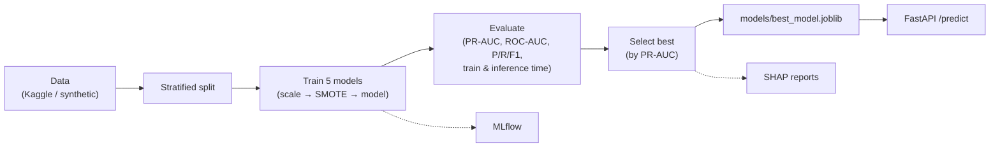

<<<<<<< HEAD
[](https://github.com/MohdMudassirPasha/credit-card-fraud-detection/actions/workflows/ci.yml)


# 💳 Credit Card Fraud Detection
Production-grade end-to-end machine learning system for detecting fraudulent credit card transactions using XGBoost, FastAPI and modern MLOps practices.
</div>

---
=======
# Credit Card Fraud Detection

An end-to-end machine-learning pipeline for detecting fraudulent credit card
transactions on a highly imbalanced dataset.

[](https://github.com/MohdMudassirPasha/credit-card-fraud-detection/actions/workflows/ci.yml)


>>>>>>> fa192f5 (Checkpoint before API limit)

## Overview

Fraud is about 0.17% of transactions in this dataset, so a model that always
predicts "not fraud" scores 99.8% accuracy while catching nothing. This pipeline
is built around the metrics that actually matter under that imbalance —
precision, recall, F1, and PR-AUC — rather than accuracy.

A few design choices worth calling out:

- **Config-driven.** A single `configs/config.yaml` holds every seed, split,
  hyperparameter, threshold, and path, so there are no magic numbers scattered
  through the code.
- **Leakage-free pipelines.** Scaling and SMOTE live inside an `imblearn`
  pipeline and are fit on training folds only.
- **Five models compared.** Logistic Regression, Random Forest, XGBoost,
  LightGBM, and CatBoost are benchmarked, and the best by PR-AUC is selected.
- **Tuning, tracking, explainability.** Optuna for hyperparameter search, MLflow
  for experiment tracking, SHAP for feature attributions.
- **Serving and CI.** A FastAPI service, a Docker image, a pytest suite, and a
  GitHub Actions workflow.

The project uses the Kaggle
[Credit Card Fraud Detection](https://www.kaggle.com/datasets/mlg-ulb/creditcardfraud)
dataset. When the data (or Kaggle credentials) is unavailable, the pipeline
falls back to a synthetic generator with the same schema and class balance, so
it runs end-to-end offline — in CI or on a fresh clone — without any setup.

## Architecture

See [`docs/architecture.md`](docs/architecture.md) for the full diagrams. In short:



## Project structure

```
credit-card-fraud-detection/
├── app/                      # FastAPI serving layer
│   ├── api.py                #   routes: / , /health, /predict, /predict/batch
│   ├── schemas.py            #   Pydantic request/response models
│   └── startup.py            #   one-time model loading
├── configs/
│   └── config.yaml           # single source of truth for all settings
├── data/
│   ├── raw/                  # downloaded dataset (gitignored)
│   └── processed/
├── docs/
│   └── architecture.md       # architecture & pipeline diagrams
├── models/                   # best_model.joblib + model_metadata.json (gitignored)
├── notebooks/
│   └── 01_exploratory_data_analysis.ipynb
├── reports/                  # plots, metrics CSV/JSON, SHAP, Optuna, comparison
├── src/
│   ├── config.py             # typed (pydantic) config loader
│   ├── logger.py             # central logging (console + rotating file)
│   ├── exceptions.py         # custom exception hierarchy
│   ├── data/                 # Kaggle download, synthetic generator, loader
│   ├── preprocessing.py      # leakage-free imblearn pipeline construction
│   ├── models.py             # 5-model registry + Optuna search spaces
│   ├── train.py              # training + timing
│   ├── tune.py               # Optuna hyperparameter optimisation
│   ├── evaluate.py           # metrics, threshold tuning, plots, comparison
│   ├── explain.py            # SHAP explainability
│   ├── tracking.py           # MLflow helpers
│   └── predict.py            # inference wrapper
├── tests/                    # pytest suite (config, data, train, eval, predict, API)
├── .github/workflows/ci.yml  # lint + test + smoke pipeline + docker build
├── main.py                   # end-to-end CLI orchestrator
├── Dockerfile / docker-compose.yml / Makefile
└── requirements.txt / requirements-dev.txt / pyproject.toml
```

## Installation

```bash
git clone https://github.com/MohdMudassirPasha/credit-card-fraud-detection.git
cd credit-card-fraud-detection

python -m venv .venv
source .venv/bin/activate          # Windows: .venv\Scripts\activate

pip install -r requirements.txt        # runtime only
# or, for development (tests + linters):
pip install -r requirements-dev.txt
```

## Dataset setup (optional — the synthetic fallback works without this)

To train on the real Kaggle data:

1. Create a Kaggle account and generate an API token
   (Kaggle → *Account* → *Create New API Token*). This downloads `kaggle.json`.
2. Place it at `~/.kaggle/kaggle.json` (Windows: `C:\Users\<you>\.kaggle\kaggle.json`)
   — or set the `KAGGLE_USERNAME` / `KAGGLE_KEY` environment variables.
3. Download the dataset:

   ```bash
   python -m src.data.download      # or: make data
   ```

This fetches `creditcard.csv` (~150 MB) into `data/raw/`. Large data files are
not committed; they are regenerated on demand. If the file is absent, the
pipeline uses the synthetic generator instead.

## Usage

### Train and evaluate

```bash
python main.py                        # all 5 models, no tuning
python main.py --tune                 # with Optuna hyperparameter tuning
python main.py --models xgboost lightgbm   # a subset
python main.py --no-mlflow            # disable experiment tracking
```

A run will:

1. Load data (real or synthetic) and make a stratified train/test split.
2. Optionally tune hyperparameters with Optuna.
3. Train all five models in leakage-free pipelines, logging each to MLflow.
4. Evaluate on the held-out test set and write the plots and reports.
5. Save every model's metrics to `reports/metrics_summary.{csv,json}`.
6. Promote the best model (by PR-AUC) to `models/best_model.joblib` and generate
   SHAP reports for it.

### Inspect experiments (MLflow)

```bash
make mlflow                           # → http://localhost:5000
```

### Serve the model

```bash
make api                              # uvicorn on http://localhost:8000
# Interactive docs at http://localhost:8000/docs
```

## API

| Method | Endpoint         | Description                                    |
| ------ | ---------------- | ---------------------------------------------- |
| `GET`  | `/`              | Service metadata and available endpoints.      |
| `GET`  | `/health`        | Liveness/readiness; reports if model is loaded. |
| `POST` | `/predict`       | Score a single transaction.                    |
| `POST` | `/predict/batch` | Score many transactions in one call.           |

**Example request:**

```bash
curl -X POST http://localhost:8000/predict \
  -H "Content-Type: application/json" \
  -d '{"Time": 10000, "V1": 0, "V2": 0, "V3": 0, "V4": 0, "V5": 0, "V6": 0,
       "V7": 0, "V8": 0, "V9": 0, "V10": 0, "V11": 0, "V12": 0, "V13": 0,
       "V14": 0, "V15": 0, "V16": 0, "V17": 0, "V18": 0, "V19": 0, "V20": 0,
       "V21": 0, "V22": 0, "V23": 0, "V24": 0, "V25": 0, "V26": 0, "V27": 0,
       "V28": 0, "Amount": 149.62}'
```

**Example response:**

```json
{
  "is_fraud": false,
  "fraud_probability": 0.0123,
  "threshold": 0.84,
  "model_name": "xgboost"
}
```

## Performance and evaluation

Metrics are computed on a held-out, un-resampled test set that keeps the
real-world class imbalance, with the decision threshold tuned to maximise F1 on
the precision-recall curve. They are generated fresh on every run — see
`reports/metrics_summary.csv` and the plots below; nothing here is hardcoded.

For each model the pipeline records PR-AUC, ROC-AUC, precision, recall, F1,
training time, and inference time. The best model by PR-AUC is selected
automatically.

Generated reports (in `reports/`):

| Report | File(s) |
| --- | --- |
| Model comparison (5 models) | `model_comparison.png`, `metrics_summary.csv`, `metrics_summary.json` |
| ROC curve | `roc_curve_<model>.png` |
| Precision-Recall curve | `pr_curve_<model>.png` |
| Confusion matrix | `confusion_matrix_<model>.png` |
| Threshold analysis | `threshold_analysis_<model>.png` |
| Classification report | `classification_report_<model>.txt` |
| SHAP (summary / bar / force / importance) | `shap/` |
| Optuna (history / importances / best params) | `optuna/` |

PR-AUC is used for model selection rather than accuracy or ROC-AUC: on a
99.8%/0.2% split accuracy is meaningless, and ROC-AUC can look strong even when
the positive class is predicted poorly. PR-AUC focuses on the rare fraud class.

## Docker

Run the API and the MLflow UI together:

```bash
docker compose up --build
```

- API → http://localhost:8000 (docs at `/docs`)
- MLflow → http://localhost:5000

Or build and run just the API image:

```bash
make docker            # docker build -t credit-card-fraud-detection:latest .
docker run -p 8000:8000 -v "$(pwd)/models:/app/models" credit-card-fraud-detection:latest
```

## Testing and quality

```bash
make test              # pytest (config, preprocessing, training, evaluation,
                       #         prediction, API endpoints)
make lint              # ruff + black --check + isort --check
make format            # auto-format with black + isort
```

CI (GitHub Actions) runs linting, the test suite with coverage, a smoke training
run on synthetic data, and a Docker build on every push and pull request.

## Makefile commands

| Command | Description |
| --- | --- |
| `make install` / `make install-dev` | Install runtime / dev dependencies |
| `make data` | Download the Kaggle dataset |
| `make train` / `make tune` | Run the pipeline (without / with Optuna tuning) |
| `make api` | Serve the FastAPI app |
| `make mlflow` | Launch the MLflow UI |
| `make test` / `make lint` / `make format` | Quality gates |
| `make docker` / `make docker-up` | Build image / run full stack |
| `make clean` | Remove caches and generated artifacts |

## Possible next steps

- Cost-sensitive thresholding: assign a cost to false negatives vs. false
  positives and optimise expected cost instead of F1.
- Probability calibration (isotonic / Platt) on the imbalanced test distribution.
- Drift monitoring and scheduled retraining.
- Model registry and staged deployment (MLflow Model Registry).
- Feature store integration with online/offline parity checks.

## License

Released under the [MIT License](LICENSE).
