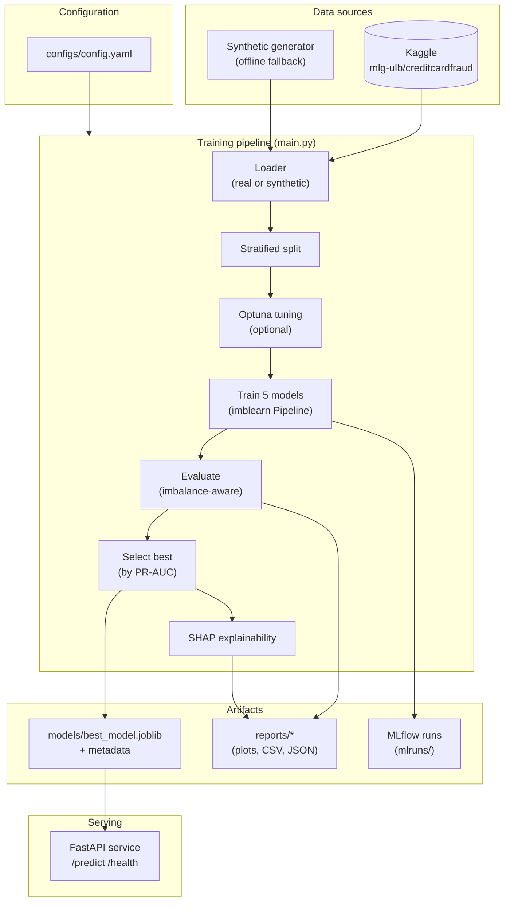
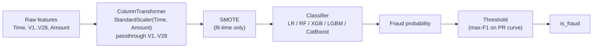
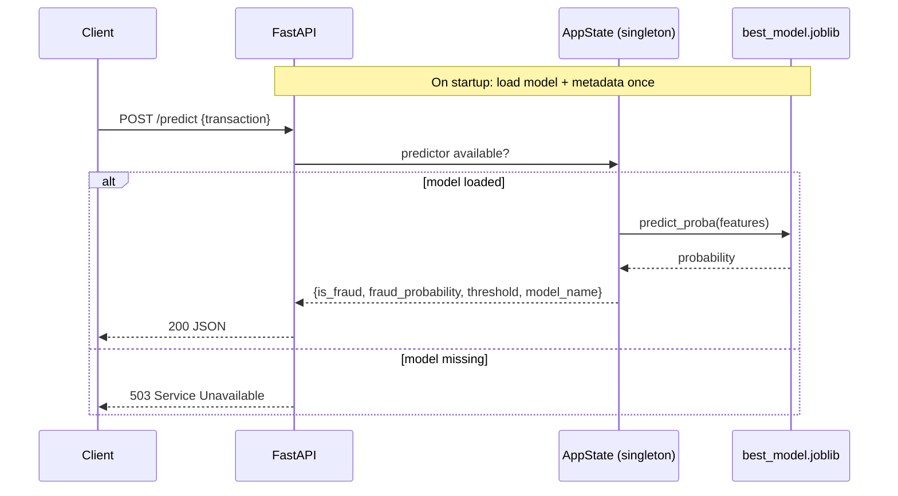

# Architecture

This document describes the system architecture, the ML pipeline, and the
serving path of the Credit Card Fraud Detection project.

## System overview

## ML pipeline (leakage-free)

Every model is wrapped in an `imblearn` `Pipeline` so that scaling and SMOTE are
fit **inside** cross-validation folds and on the training split only. SMOTE acts
during `fit` and is automatically a no-op at inference, so the persisted pipeline
is directly deployable.

## Why these choices

| Decision | Rationale |
| --- | --- |
| **PR-AUC for selection** | On a ~0.17% positive class, accuracy and even ROC-AUC are misleading; PR-AUC reflects performance on the rare positive class. |
| **SMOTE inside the pipeline** | Prevents test-set leakage and makes the saved artifact self-contained. |
| **Threshold tuning** | SMOTE rebalances the training distribution, miscalibrating probabilities; the default 0.5 cutoff is a poor operating point. |
| **Synthetic fallback** | Keeps the project runnable offline (CI, fresh clones) with zero credentials, without removing real-data support. |
| **Config-driven** | A single `config.yaml` makes runs reproducible and removes magic numbers from code. |

## Request flow (serving)

