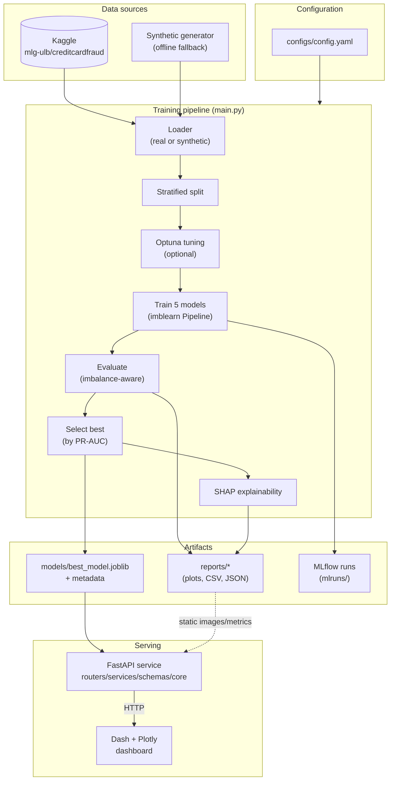
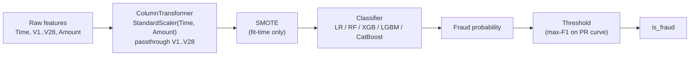
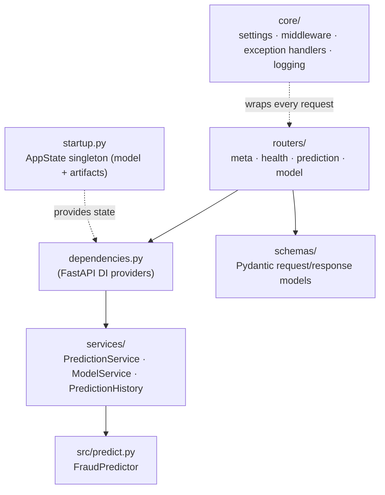
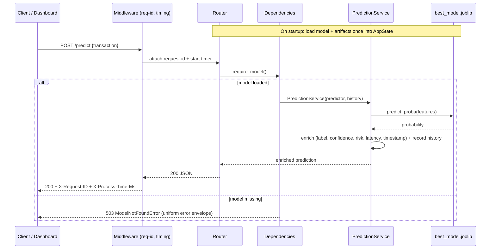
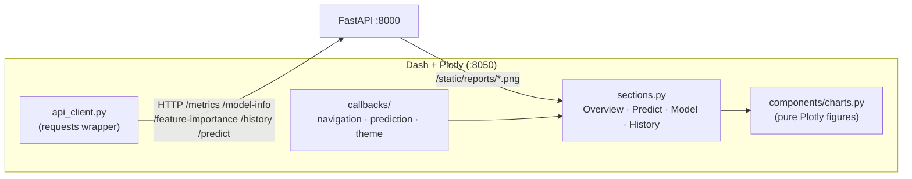

# Architecture

This document describes the system architecture, the ML pipeline, the layered
serving backend, and the analytics dashboard of the Credit Card Fraud Detection
project.

The system has **three decoupled layers**:

1. **Training pipeline** (`src/`, `main.py`) — produces the production artifacts.
2. **REST API** (`app/`) — a layered FastAPI service that *loads* and serves the
   model (never retrains).
3. **Dashboard** (`dashboard/`) — a Dash + Plotly frontend that consumes the API
   over HTTP.

## System overview

## ML pipeline (leakage-free)

Every model is wrapped in an `imblearn` `Pipeline` so that scaling and SMOTE are
fit **inside** cross-validation folds and on the training split only. SMOTE acts
during `fit` and is automatically a no-op at inference, so the persisted pipeline
is directly deployable.

## Why these choices

| Decision | Rationale |
| --- | --- |
| **PR-AUC for selection** | On a ~0.17% positive class, accuracy and even ROC-AUC are misleading; PR-AUC reflects performance on the rare positive class. |
| **SMOTE inside the pipeline** | Prevents test-set leakage and makes the saved artifact self-contained. |
| **Threshold tuning** | SMOTE rebalances the training distribution, miscalibrating probabilities; the default 0.5 cutoff is a poor operating point. |
| **Synthetic fallback** | Keeps the project runnable offline (CI, fresh clones) with zero credentials, without removing real-data support. |
| **Config-driven** | A single `config.yaml` makes runs reproducible and removes magic numbers from code. |

## Serving architecture (layered backend)

The API follows a layered architecture so each concern has a single home and
routers stay thin (parse → call a service → return a schema):

| Layer | Responsibility |
| --- | --- |
| `core/` | Settings (`pydantic-settings`), request-context middleware (request id + latency), centralized exception handlers, logging. |
| `schemas/` | Validated, self-documenting request/response models (rich OpenAPI). |
| `services/` | Business logic: enrich predictions, read report artifacts, track history. |
| `routers/` | HTTP endpoints grouped by concern; no business logic. |
| `dependencies.py` | Dependency-injection seam wiring services from `AppState`. |
| `startup.py` | Loads the model + report artifacts **once** at startup into a process-wide singleton. |

## Request flow (serving)

## Dashboard

The dashboard is a separate process that never imports the model or the `app`
package — all data flows through the REST API, exactly as a real frontend would.

Design notes:

- **Pure figure builders** (`components/charts.py`) take data + a theme and return
  Plotly figures with no network access — making them unit-testable.
- **Hybrid charts** — interactive Plotly for metrics, feature importance, class
  distribution, and the live history stream; the ROC / PR / confusion-matrix PNGs
  produced by the training pipeline are served by the API as static files and
  embedded directly.
- **Themes** — a dark/light toggle writes to a `dcc.Store`; CSS variables in
  `assets/styles.css` re-cascade and charts re-render with matching colours.
- **Resilience** — every API call returns `(data, error)`; a backend hiccup shows
  a banner instead of crashing the UI.
